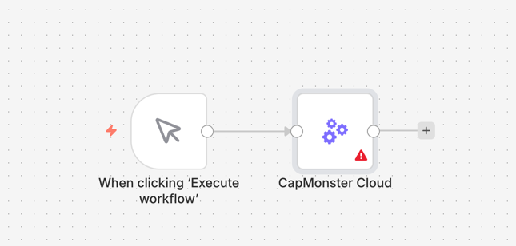
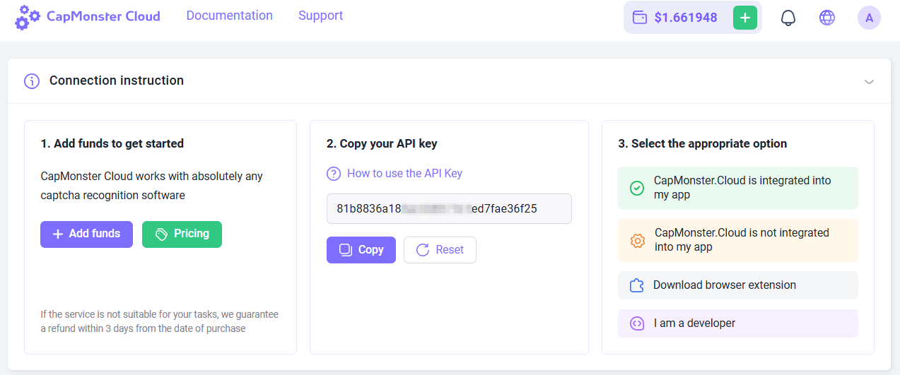
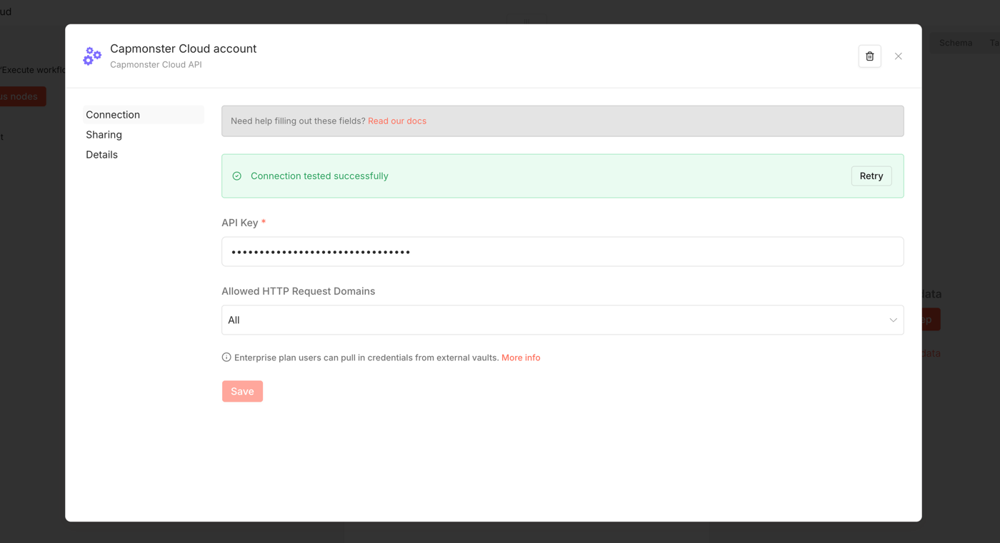
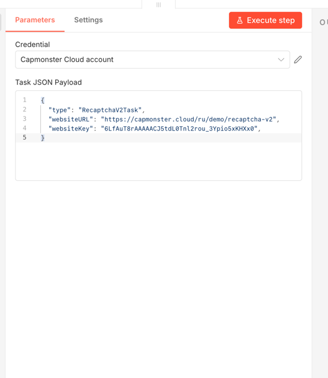

## Resources & Documentation

- **Official Documentation**: [CapMonster Cloud Docs](https://docs.capmonster.cloud/) — Full API reference and guide.
- **n8n Community Nodes**: [Official n8n Guide](https://n8n.io) for installing and managing community nodes.

## How to use

1. **Add Node**: Search for **CapMonster Cloud** in your n8n workflow.

2. **Get your API Key**: Copy it from your [CapMonster Cloud Dashboard](https://dash.capmonster.cloud).

3. **Add Api Key to node**:

4. **Customize Payload**:

    - Find the exact JSON structure in the [Official Task Documentation](https://docs.capmonster.cloud/docs/captchas/).
      ```json 
      {
          "type":"RecaptchaV2Task",
          "websiteURL":"https://lessons.zennolab.com/captchas/recaptcha/v2_simple.php?level=high",
          "websiteKey":"6Lcg7CMUAAAAANphynKgn9YAgA4tQ2KI_iqRyTwd"
      }
      ```
5. **Execution**: The node will automatically:
    - Return the solution (token) once it's ready.
