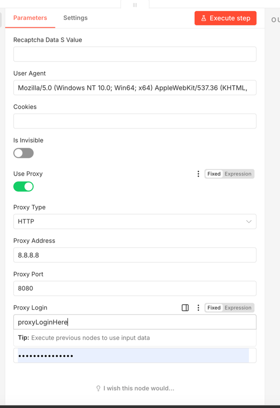

## Resources & Documentation

- **Official Documentation**: [CapMonster Cloud Docs](https://docs.capmonster.cloud/) — Full API reference and guide.
- **n8n Community Nodes**: [Official n8n Guide](https://n8n.io) for installing and managing community nodes.

## How to use

1. **Add Node**: Search for **CapMonster Cloud** in your n8n workflow.


2. **Get your API Key**: Copy it from your [CapMonster Cloud Dashboard](https://dash.capmonster.cloud).


3. **Add Api Key to node**:

4. Select Task Type:


- Use the Task Type dropdown to choose the kind of captcha you want to solve:
  - JSON (Custom Task) – supply any valid CapMonster task JSON.
  - Recaptcha V2 / V2 Enterprise / V2 Proxy
  - Recaptcha V3 / V3 Enterprise
  - Image to Text
  - GeeTest
  - Cloudflare Turnstile (token, managed challenge, waiting room)
  - Complex Image Tasks (click, recognition)
  - DataDome, Basilisk, TenDI, Amazon (multiple variants), Binance, Imperva, Prosopo, Temu, Yidun, MTCaptcha, Altcha, FunCaptcha, Castle, TSPD, Hunt
  - Some task types support optional proxy settings.
  

5. **Customize Payload**:
   - For JSON tasks, supply a full CapMonster JSON object without clientKey. 
   - For built-in task types, fill the provided fields (e.g., websiteURL, websiteKey, userAgent, metadata). 
   - If the task supports proxies, enable Use Proxy and fill the proxy details.

    - Find the exact JSON structure in the [Official Task Documentation](https://docs.capmonster.cloud/docs/captchas/).
      ```json 
      {
          "type":"RecaptchaV2Task",
          "websiteURL":"https://lessons.zennolab.com/captchas/recaptcha/v2_simple.php?level=high",
          "websiteKey":"6Lcg7CMUAAAAANphynKgn9YAgA4tQ2KI_iqRyTwd"
      }
      ```
6. **Execution**: The node will automatically:
    - Return the solution (token) once it's ready.
